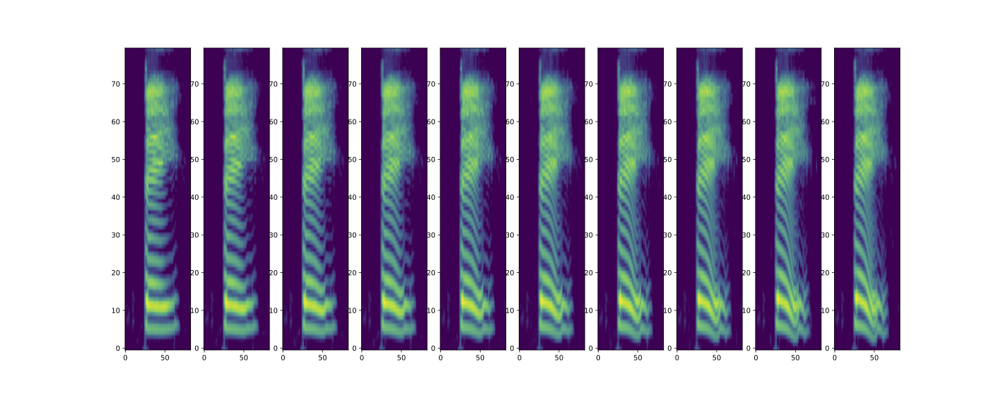
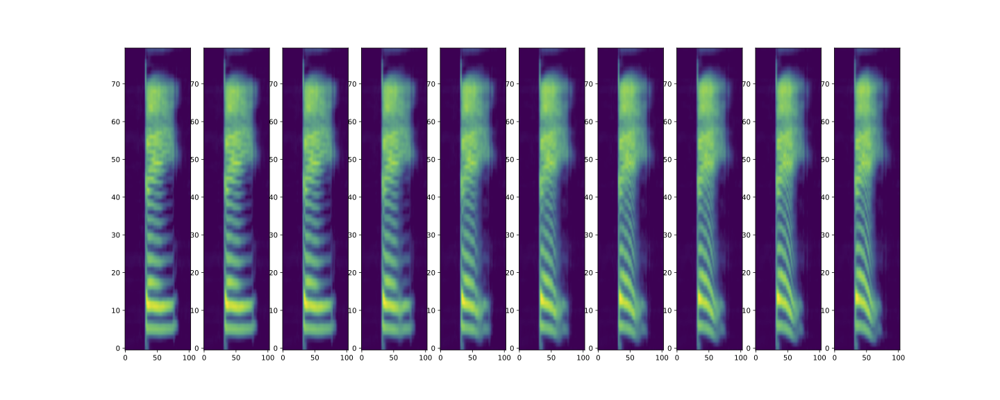

## Stage 1 (before adversarially train)

## Stage 2 (after adversarially train)

## /bei1/ to /bei4/ using WORLD

#### 1
<audio controls="controls">
<source type="audio/wav" src="source/audio/world1.wav"></source>
</audio>

#### 2
<audio controls="controls">
<source type="audio/wav" src="source/audio/world2.wav"></source>
</audio>

#### 3
<audio controls="controls">
<source type="audio/wav" src="source/audio/world3.wav"></source>
</audio>

#### 4
<audio controls="controls">
<source type="audio/wav" src="source/audio/world4.wav"></source>
</audio>

#### 5
<audio controls="controls">
<source type="audio/wav" src="source/audio/world5.wav"></source>
</audio>

#### 6
<audio controls="controls">
<source type="audio/wav" src="source/audio/world6.wav"></source>
</audio>

#### 7
<audio controls="controls">
<source type="audio/wav" src="source/audio/world7.wav"></source>
</audio>

#### 8
<audio controls="controls">
<source type="audio/wav" src="source/audio/world8.wav"></source>
</audio>

#### 9
<audio controls="controls">
<source type="audio/wav" src="source/audio/world9.wav"></source>
</audio>

#### 10
<audio controls="controls">
<source type="audio/wav" src="source/audio/world10.wav"></source>
</audio>

## /bei1/ to /bei4/ using our proposed methed

<audio controls="controls">
<source type="audio/wav" src="source/audio/train1.wav"></source>
</audio>
